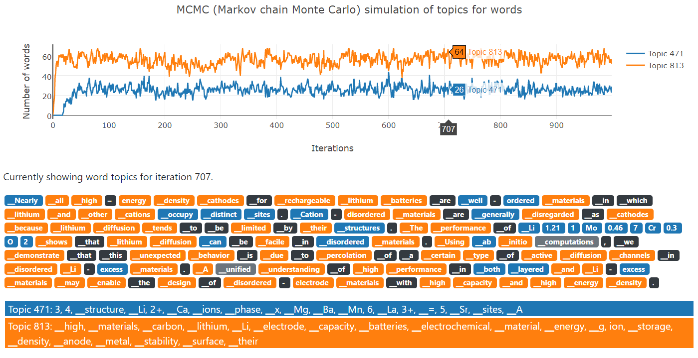

# ScientificTopics
Topic models trained on millions of scientific papers.

## What is it?

This repo contains codes and data files of LDA (latent Dirichlet allocation) 
topic models trained on millions of scientific articles. It could be used to
infer scientific topics for new paragraphs.

## How does it work?

There are lots of articles on the Internet explaining how LDA works. We will
not put another description of the algorithm itself here. Briefly, LDA assumes
each word in a document is associated with a **hidden random variable**, which is
the topic-word distribution index from which the word is drawn. By relating this 
hidden random variable with the topic-word distribution and the document-topic
distribution, the probability of a document can be computed. When inferring values
of these hidden random variables, you can roughly think it as trying to maximize
the likelihood of the document.



The above figure shows how LDA achieves this by using MCMC (Markov chain Monte
Carlo). In MCMC, we sample a new topic for a word each time, and compute whether 
the new topic contributes to a higher document likelihood. If so, we accept the 
new topic. After we sample for each word thousands of times, the values of the
hidden topic random variables will converge. As we can see from the above text
excerpted from https://doi.org/10.1126/science.1246432. 

When the model converges, around 60 words have 813 as their hidden topic random 
variable, meaning that they are likely to be sampled from the topic-word distribution
of 813. By inspecting this topic-word distribution we conclude that these words 
describe Li-ion battery technologies. Same happens to the 30 words with topic id
471, which describes chemical formulas and structures.

## How to play with it?

We have trained a robust LDA model using 10 million paragraphs with 7.5 billion 
words, which are randomly drawn from 4 million papers primarily focused on solid
state chemistry. We trained models with 500 and 1000 topics. Here are descriptions
to the model files:

```
data_20190830/model_100000.model ## sentencepiece model with 100k vocabulary 
data_20190830/model_100000.vocab
data_20190830/punkt.params  ## Parameters to the Punkt sentence segmenter.
data_20190830/lda_run2/topic_500/server_*_table_*.model  ## Model parameters for 500 topics
data_20190830/lda_run2/topic_1000/server_*_table_*.model  ## Model parameters for 1000 topics
```

If you need to infer topics for new paragraphs, put them into a file, line by line,
and run command:

```bash
python lda_tools.py infer \
    --lda-result-dir data_20190830/lda_run2/topic_1000 \
    --input input.txt \
    --output output.txt \
    --params data_20190830/punkt.params \
    --spm data_20190830/model_100000.model \
    --num-vocabs 100000 \
    --stopwords stopwords.txt \
    --generate-html
```

`input.txt` and `output.txt` will be input paragraphs and output topic results, 
`--generate-html` will allow generation of HTML visualization files `plot.*.html`.

## Citing

If you find this work useful for your projects, please consider citing:

```latex
@article{huo2019semi,
  title={Semi-supervised machine-learning classification of materials synthesis procedures},
  author={Huo, Haoyan and Rong, Ziqin and Kononova, Olga and Sun, Wenhao and Botari, Tiago and He, Tanjin and Tshitoyan, Vahe and Ceder, Gerbrand},
  journal={npj Computational Materials},
  volume={5},
  number={1},
  pages={62},
  year={2019},
  publisher={Nature Publishing Group}
}
```

Note that this repo is implemented differently as described in the paper. 
Specifically, we have updated to use Punkt, sentencepiece, LightLDA to handle
much more large datasets. 

## Questions

Please file a issue if you have any questions.

## References

Here are additional refs that you can read to understand how this repo is implemented:

1. Blei, David M., Andrew Y. Ng, and Michael I. Jordan. "Latent dirichlet allocation." Journal of machine Learning research 3.Jan (2003): 993-1022.
2. Kiss, Tibor, and Jan Strunk. "Unsupervised multilingual sentence boundary detection." Computational Linguistics 32.4 (2006): 485-525.
3. Kudo, Taku, and John Richardson. "Sentencepiece: A simple and language independent subword tokenizer and detokenizer for neural text processing." arXiv preprint arXiv:1808.06226 (2018).
4. Yuan, Jinhui, et al. "Lightlda: Big topic models on modest computer clusters." Proceedings of the 24th International Conference on World Wide Web. International World Wide Web Conferences Steering Committee, 2015.